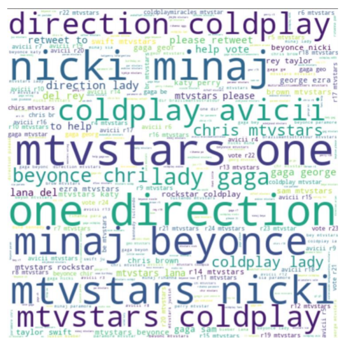

## ANALYSIS ON TWITTER DATASET

### Abstract

This is a concise report of exploration, analysis and findings on the twitter API dataset.
The tools used for this project are PySpark for querying and analysing and pandas for
visualizing the results. The key analysis included finding out the most tweeted hashtags for a
particular period of time, analysis of behaviour of the users with highest tweets including that
hashtag. This also includes text analysis and making a wordcloud of the text in the tweets of
users most tweeting about it. It was found that an online voting campaign was on during 2014
to aid in selecting a winner for the best music artist for 2014. We found that the words in the
wordcloud formed were mostly popular music artists and bands that were globally famous.
However, it couldn’t be cross checked with the actual winner as there were many winners in
different category of awards.

### Results

The approach used in this project was to focus on a specific period of time and look at the
hashtags most tweeted about. Hashtags like MTV Stars etc were tweeted a lot more than the other hashtags in the period 11th December 2014 to 19th December 2014.
As there was an online campaign
running during that period which required users to tweet #MTVStars followed by their favourite music star of the year 2014 in order for the star to win the award.

The major takeaway from this analysis is that a lot of users had taken part in the MTV Stars
online voting campaign. The top users tweeting about it were fan accounts of major music
artists like Nicki Minaj, Justin Beiber etc. These were not the official accounts of the artists
themselves but fan accounts. However, since we sampled for a very short duration of the
entire campaign that ran from September to December, the insights from our results didn’t
apply in the bigger picture. Therefore, our sample was not representative of the user
population that took part in the campaign

### Wordcloud created

